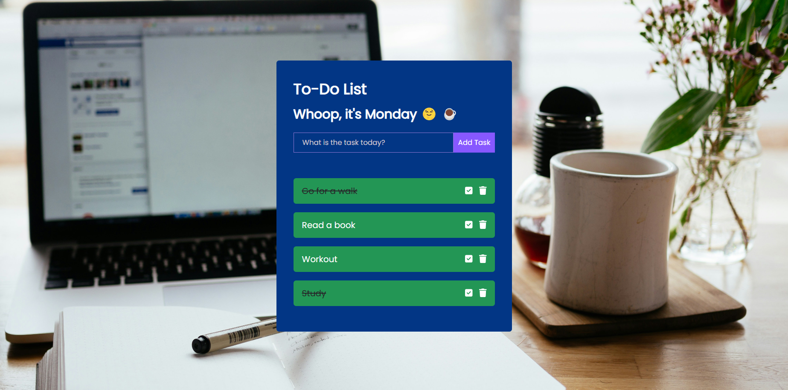

# To-Do List

## Description

This To-Do App is a simple yet powerful application designed to help you manage your tasks efficiently. With an intuitive user interface and essential features, it allows you to easily add, delete, and mark tasks as completed. Whether you're organizing your daily activities, planning a project, or just keeping track of your errands, this app provides the functionality you need to stay organized and productive.

### Features

- **Add Tasks:** Quickly add new tasks to your to-do list.
- **Delete Tasks:** Remove tasks that are no longer needed.
- **Toggle Completion:** Mark tasks as complete or incomplete with a single click.

